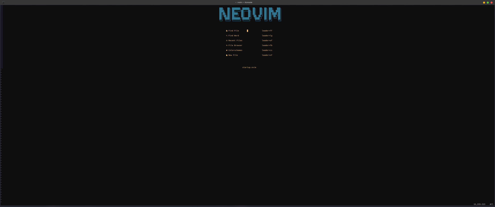

# My NeoVim configurations

<!-- [Nvim Refrence](https://neovim.io/doc/user/lua.html) -->

  

## Preview

<!--  -->

  

### Plugins
[Rose-Pine Color Theme](https://github.com/rose-pine/neovim) 
[bufferline](https://github.com/akinsho/bufferline.nvim) 
[coc](https://github.com/neoclide/coc.nvim) 
[fugitive](https://github.com/tpope/vim-fugitive) 
[harpoon](https://github.com/theprimeagen/harpoon) 
[lsp](https://github.com/VonHeikemen/lsp-zero.nvim) 
[lualine](https://github.com/nvim-lualine/lualine.nvim) 
[Markdown Preview](https://github.com/iamcco/markdown-preview.nvim) 
[Neo-Tree](https://github.com/nvim-neo-tree/neo-tree.nvim) 
[Startup](https://github.com/startup-nvim/startup.nvim) 
[telescope](https://github.com/nvim-telescope/telescope.nvim) 
[toggleterm](https://github.com/akinsho/toggleterm.nvim) 
[treesitter](https://github.com/nvim-treesitter/nvim-treesitter) 
[undotree](https://github.com/mbbill/undotree) 
[dap](https://github.com/mfussenegger/nvim-dap) 
[dap-ui](https://github.com/rcarriga/nvim-dap-ui) 
[notify](https://github.com/rcarriga/nvim-notify) 
[lazygit](https://github.com/kdheepak/lazygit.nvim) 
[Comment](https://github.com/numToStr/Comment.nvim) 
[Tokyonight](https://github.com/folke/tokyonight.nvim) 
[NightFox](https://github.com/EdenEast/nightfox.nvim) 
[OneDark](https://github.com/navarasu/onedark.nvim) 
[tagbar](https://github.com/preservim/tagbar) 

  

### ToDo
- add ascii icon to startup.nvim

